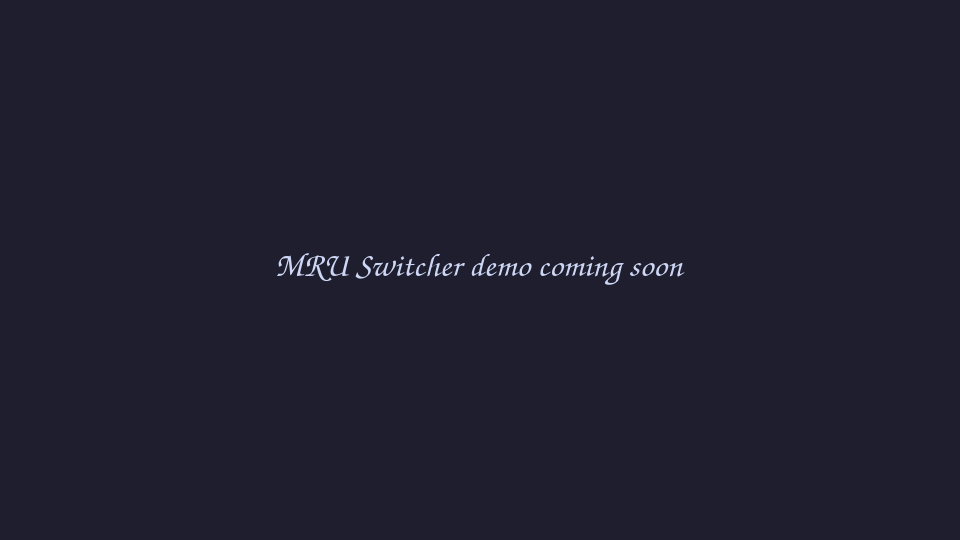

<p align="center">
  
</p>

<h1 align="center">MRU Window Switcher</h1>

<p align="center">
  <strong>Niri-style MRU Alt+Tab for Hyprland.</strong>
  <br>
  Switch back to the window you were just using — frozen list, virtual selection, focus applied only when you release the key.
</p>

<p align="center">
  <a href="https://github.com/code-warlord-dev/mru-switcher/actions/workflows/ci.yml">
    
  </a>
  <a href="https://github.com/code-warlord-dev/mru-switcher/releases">
    
  </a>
  <a href="https://github.com/code-warlord-dev/mru-switcher/blob/main/LICENSE">
    
  </a>
  
  <a href="https://hyprland.org">
    
  </a>
  <a href="https://omarchy.org">
    
  </a>
  <a href="https://wiki.hyprland.org/Plugins/">
    
  </a>
  
</p>

---

## Positioning

**Built for Hyprland — and especially for Omarchy.** MRU Switcher is a native
[Hyprland](https://hyprland.org) plugin, developed and verified on Hyprland,
and [Omarchy](https://omarchy.org) is a first-class target for it.

**Interaction model inspired by Niri.** The workflow is borrowed from
[Niri](https://github.com/YaLTeR/niri)'s recent-windows interaction — MRU
order, a frozen list while you tab, apply-on-release — and given a native home
inside Hyprland. This is not an attempt to make Hyprland behave like Niri; the
platform is Hyprland, the interaction idea comes from Niri.

---

## What it is

MRU Switcher brings a proper, predictable Alt+Tab workflow to Hyprland:
windows are ordered by **most-recently-used**, the list stays stable while you
hold Alt, and focus changes only when you release the modifier.

```text
Alt + Tab
    │
    ├── Tab       → move through the MRU list
    ├── Tab       → move again
    ├── Shift+Tab → go back
    │
    └── release Alt → focus the selected window
```

No focus jumping while you browse. No MRU history being rewritten underneath
you. No guessing which window comes next.

## See it in action

<p align="center">
  
</p>

The preview shows the core interaction: the selection moves through the frozen
MRU list while the real focus stays where it is until the switch is committed.

---

## Why

Traditional window switching is tied to workspace order, stack order, or the
compositor's current layout. That is not always how people think.

When you are working, the mental model is usually much simpler:

> "Take me back to the thing I was just using."

MRU Switcher keeps that context explicit. Selection and focus are separate
concerns — you can browse the list without making Hyprland focus every
intermediate window, and your real MRU history stays clean.

---

## Features

* **MRU window ordering** — switch by recent usage rather than layout position
* **Frozen session snapshot** — the candidate list stays stable while tabbing
* **Apply-on-release** — real focus changes only when the session is committed
* **History lock-in** — intermediate switching does not corrupt MRU history
* **Debounce** — short-lived focus changes do not immediately reshuffle history
* **Five scopes** — switch across all windows, or just the current monitor,
  workspace, visible workspaces, or the current app
* **Stable window identity** — recycled window IDs can never turn into stale
  references mid-session
* **Optional border highlight** — visually show the selected window without
  moving real focus
* **Safe invalidation** — closing a selected window mid-session is handled
  cleanly, no crashes
* **Explicit dispatchers** — a real Hyprland plugin with a small, documented
  command surface (`mru:cycle`, `mru:apply`, `mru:cancel`, `mru:status`)

---

## Installation

MRU Switcher is a native Hyprland plugin, built and tested against
**Hyprland v0.56.2** (see [Compatibility](#compatibility)). Two channels:

**Recommended — hyprpm.** If you already manage Hyprland plugins via **hyprpm**,
this is the intended workflow: install MRU Switcher the same way. Once the
`v1.0.0` release pin is published, install it with:

```bash
hyprpm add https://github.com/code-warlord-dev/mru-switcher
hyprpm enable mru-switcher
hyprpm reload
```

> hyprpm becomes the preferred one-command install **once the pinned release
> is published**. Until that pin exists, install from source as described
> below. A Hyprland upgrade is a rebuild event — never a silent compatibility
> window.

**Build from source.** Source installs live in a canonical, `sudo`-free
directory under your home folder:

```bash
mkdir -p ~/.local/src
git clone https://github.com/code-warlord-dev/mru-switcher.git ~/.local/src/mru-switcher
cd ~/.local/src/mru-switcher
cmake -S . -B build -DCMAKE_BUILD_TYPE=Release -DMRU_BUILD_PLUGIN=ON
cmake --build build -j
```

The plugin is `~/.local/src/mru-switcher/build/mru-switcher.so`. Load it:

```bash
hyprctl plugin load "$HOME/.local/src/mru-switcher/build/mru-switcher.so"
```

(Or point the equivalent `plugin =` line in `hyprland.conf` at the same
path — either way, no root and no system directories involved.)

---

## First setup

Copy the example configuration and keybindings into your Hyprland config
directory, then `source` them from `hyprland.conf`:

```bash
mkdir -p ~/.config/hypr/conf.d
cp ~/.local/src/mru-switcher/examples/mru-switcher.conf ~/.config/hypr/conf.d/mru-switcher.conf
cp ~/.local/src/mru-switcher/examples/mru-switcher-bindings.conf ~/.config/hypr/conf.d/mru-switcher-bindings.conf
```

Add these lines to `hyprland.conf`:

```conf
source = ~/.config/hypr/conf.d/mru-switcher.conf
source = ~/.config/hypr/conf.d/mru-switcher-bindings.conf
```

Then reload:

```bash
hyprctl reload
```

That is the whole classic workflow: `Alt+Tab` cycles the frozen list, releasing
`Alt` applies the selection, `Escape` cancels. The example config ships with
`ui = border` (a first-run override of the plugin default) so you can see the
selection while you browse; see the comments in the file to switch it back to
`null`.

---

## Configuration overview

The files under `examples/` are your starting point, not a minimal inline
snippet:

* `examples/mru-switcher.conf` — the complete `plugin { mru-switcher { … } }`
  block, every key documented inline: purpose, default, allowed values, and a
  short recommendation.
* `examples/mru-switcher-bindings.conf` — the four recommended keybindings.

The plugin reads its settings when it loads; after editing the config, run
`hyprctl reload` and changes apply to your **next** Alt+Tab session (an open
session keeps the policy it started with). Quick reference of the options:
behaviour (`debounce_ms`, `start_offset`, `wrap`), default scope, history
behaviour (`lock_history_on_session`, `restore_focus_on_cancel`), and the UI
backend (`ui`, plus `border_style` / `border_color` / `border_size` for the
border backend and `external_socket` for the external one).

The full reference lives in [docs/USER.md](docs/USER.md).

---

## Scopes and UI

**Scopes** — pass a scope as an argument to `mru:cycle`, or set a default in
config:

| Scope       | Windows included                                |
| ----------- | ----------------------------------------------- |
| `global`    | All mapped windows                              |
| `monitor`   | Windows on the current monitor                  |
| `workspace` | Windows on the current workspace                |
| `visible`   | Windows on currently visible workspaces         |
| `app`       | Windows of the currently focused app            |

```conf
bind = ALT, TAB, mru:cycle, next monitor
```

**UI backends** — the switching logic is independent of how it looks:

* `null` — no visual feedback (the built-in default; pure keyboard workflow)
* `border` — highlights the selected window's border while browsing. The
  border follows the **virtual selection**; real focus only moves on apply.
* `external` — drives an out-of-process overlay over a socket for custom UIs.
  Opt-in and advanced; without a peer it behaves exactly like `null`.

Dispatcher surface:

```text
mru:cycle [next|prev] [scope]
mru:apply
mru:cancel
mru:status
```

---

## Troubleshooting

* **No visual feedback while switching** — the built-in default is `ui = null`.
  Set `ui = border` (as the example does) to see the selection.
* **Binds do nothing** — make sure the config was reloaded (`hyprctl reload`)
  and that `source = …mru-switcher-bindings.conf` is actually in your config.
* **Plugin fails to load after a Hyprland update** — this is fail-closed
  behaviour on an ABI mismatch, not a crash. Recompile against the new headers
  (source install) or wait for a release built for the newer Hyprland.
* **`unknown key` / `unknown value` warnings** — the example files match the
  currently released keys; make sure you are not mixing an older example with
  a newer plugin or vice versa.
* **List order jumps while tabbing** — keep `lock_history_on_session = true`
  and avoid other focus binds that bypass the plugin mid-session.
* **Config changes not applying** — edit the file and run
  `hyprctl reload`; an already-open session keeps its original settings until
  apply/cancel.
* **Scratchpad / special-workspace windows missing** — a hidden scratchpad is
  excluded from every scope; once shown it behaves like a normal window.
* **Per-monitor switching** — use the `monitor` scope (or a specific bind that
  passes it).

---

## Compatibility

MRU Switcher pins and tests against a specific Hyprland revision and **fails
closed** on any other build rather than risk a compositor crash:

| Component  | Version                              |
| ---------- | ------------------------------------ |
| Hyprland   | `v0.56.2`                            |
| C++        | C++23                                |
| Aquamarine | `0.15.0` (live nested verification)  |

A Hyprland upgrade is a rebuild event: rebuild against the new headers and
verify before use, or wait for a release that pins the newer revision. Live
verification evidence lives in [docs/COMPAT.md](docs/COMPAT.md).

---

## For developers

The user-facing surface stays deliberately small, while the implementation is
documented in depth under `docs/`:

1. [User guide](docs/USER.md) and [API reference](docs/API.md)
2. [Specification](docs/SPEC.md) — normative behaviour and testing requirements
3. [Architecture](docs/ARCHITECTURE.md) and [design decisions](docs/DECISIONS.md)
4. [Plugin system](docs/HYPRLAND-PLUGIN-SYSTEM.md) — host constraints
5. [Failure modes](docs/FAILURE-MODES.md) and [security](docs/SECURITY.md)
6. [Requirements traceability](docs/REQ-TRACE.md)
7. [Compatibility](docs/COMPAT.md) and [roadmap](docs/ROADMAP.md)
8. [Contributing](docs/CONTRIBUTING.md) and [changelog](CHANGELOG.md)

Building and testing from a fresh clone:

```bash
cmake -S . -B build -DMRU_BUILD_TESTS=ON -DMRU_BUILD_PLUGIN=OFF
cmake --build build -j
ctest --test-dir build --output-on-failure
```

---

## License

MIT — see [LICENSE](LICENSE).

---

<p align="center">
  <sub>Built for people who switch contexts more often than they switch workspaces.</sub>
</p>