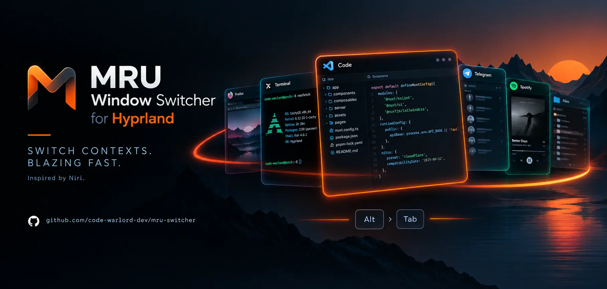
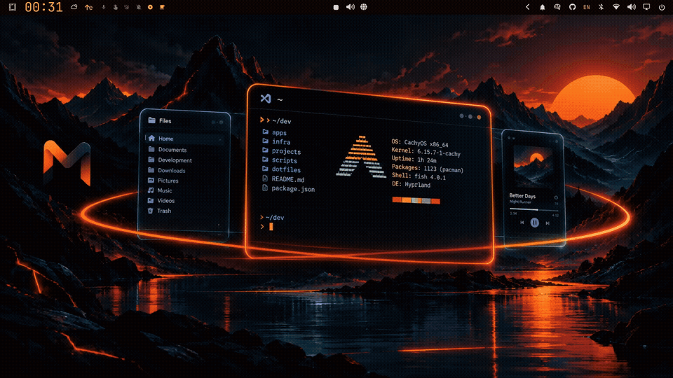

<p align="center">
  
</p>

<h1 align="center">MRU Window Switcher</h1>

<p align="center">
  <strong>Niri-style MRU Alt+Tab for Hyprland.</strong>
  <br>
  Switch back to the window you were just using — frozen list, virtual selection, focus applied only when you release the key.
</p>

<p align="center">
  <a href="https://github.com/code-warlord-dev/mru-switcher/actions/workflows/ci.yml">
    
  </a>
  <a href="https://github.com/code-warlord-dev/mru-switcher/releases">
    
  </a>
  <a href="https://github.com/code-warlord-dev/mru-switcher/blob/main/LICENSE">
    
  </a>
  
  <a href="https://hyprland.org">
    
  </a>
  <a href="https://omarchy.org">
    
  </a>
  <a href="https://wiki.hyprland.org/Plugins/">
    
  </a>
  
</p>

---

## Positioning

**Built for Hyprland — and especially for Omarchy.** MRU Switcher is a native
[Hyprland](https://hyprland.org) plugin, developed and verified on Hyprland,
and [Omarchy](https://omarchy.org) is a first-class target for it.

**Interaction model inspired by Niri.** The workflow is borrowed from
[Niri](https://github.com/YaLTeR/niri)'s recent-windows interaction — MRU
order, a frozen list while you tab, apply-on-release — and given a native home
inside Hyprland. This is not an attempt to make Hyprland behave like Niri; the
platform is Hyprland, the interaction idea comes from Niri.

---

## What it is

MRU Switcher brings a proper, predictable Alt+Tab workflow to Hyprland:
windows are ordered by **most-recently-used**, the list stays stable while you
hold Alt, and focus changes only when you release the modifier.

```text
Alt + Tab
    │
    ├── Tab       → move through the MRU list
    ├── Tab       → move again
    ├── Shift+Tab → go back
    │
    └── release Alt → focus the selected window
```

No focus jumping while you browse. No MRU history being rewritten underneath
you. No guessing which window comes next.

## See it in action

<p align="center">
  
</p>

The preview shows the core interaction: the selection moves through the frozen
MRU list while the real focus stays where it is until the switch is committed.

---

## Why

Traditional window switching is tied to workspace order, stack order, or the
compositor's current layout. That is not always how people think.

When you are working, the mental model is usually much simpler:

> "Take me back to the thing I was just using."

MRU Switcher keeps that context explicit. Selection and focus are separate
concerns — you can browse the list without making Hyprland focus every
intermediate window, and your real MRU history stays clean.

---

## Features

* **MRU window ordering** — switch by recent usage rather than layout position
* **Frozen session snapshot** — the candidate list stays stable while tabbing
* **Apply-on-release** — real focus changes only when the session is committed
* **History lock-in** — intermediate switching does not corrupt MRU history
* **Debounce** — short-lived focus changes do not immediately reshuffle history
* **Five scopes** — switch across all windows, or just the current monitor,
  workspace, visible workspaces, or the current app
* **Stable window identity** — recycled window IDs can never turn into stale
  references mid-session
* **Optional border highlight** — visually show the selected window without
  moving real focus
* **Safe invalidation** — closing a selected window mid-session is handled
  cleanly, no crashes
* **Explicit dispatchers** — a real Hyprland plugin with a small, documented
  command surface (`mru:cycle`, `mru:apply`, `mru:cancel`, `mru:status`)

---

## Installation

MRU Switcher is a native Hyprland plugin, built and tested against
**Hyprland v0.56.2** (see [Compatibility](#compatibility)). Two channels:

**Recommended — hyprpm.** If you already manage Hyprland plugins via **hyprpm**,
this is the intended workflow: install MRU Switcher the same way. Since the
`v1.0.0` release pin is published, install it with:

```bash
hyprpm add https://github.com/code-warlord-dev/mru-switcher
hyprpm enable mru-switcher
hyprpm reload
```

> hyprpm becomes the preferred one-command install **since the pinned release
> is published**. Until that pin exists, install from source as described
> below. A Hyprland upgrade is a rebuild event — never a silent compatibility
> window.
>
> **`hyprpm enable` is not enough to keep the plugin loaded.** Nothing survives a
> reboot on its own — add the one-line autostart from
> [Part 4](#part-4--load-the-plugin-on-every-login-hyprpm).

**Build from source.** Source installs live in a canonical, `sudo`-free
directory under your home folder:

```bash
mkdir -p ~/.local/src
git clone https://github.com/code-warlord-dev/mru-switcher.git ~/.local/src/mru-switcher
cd ~/.local/src/mru-switcher
cmake -S . -B build -DCMAKE_BUILD_TYPE=Release -DMRU_BUILD_PLUGIN=ON
cmake --build build -j
```

The plugin is `~/.local/src/mru-switcher/build/mru-switcher.so`. Load it:

```bash
hyprctl plugin load "$HOME/.local/src/mru-switcher/build/mru-switcher.so"
```

That directory is a **convention, not a requirement** — it keeps the commands
on this page copy-pasteable. Any other checkout builds identically: `cd` into
it and run `cmake -S . -B build -DCMAKE_BUILD_TYPE=Release -DMRU_BUILD_PLUGIN=ON`
(the plugin then lands in that checkout's `build/`). The guided installer below
does the same for whatever checkout it lives in.

(Or point the equivalent `plugin =` line in `hyprland.conf` at the same
path — either way, no root and no system directories involved.)

**Optional — guided install.** Prefer a guided install? The helper script
builds the checkout it runs from, verifies your Hyprland headers against the
pin, and prints the paths it used — so it works from any directory, not only
`~/.local/src/mru-switcher`:

```bash
git clone https://github.com/code-warlord-dev/mru-switcher.git ~/.local/src/mru-switcher && cd ~/.local/src/mru-switcher && ./scripts/install.sh
```

Run `./scripts/install.sh --help` for flags.

---

## First setup

**Important: the plugin does not capture the keyboard by itself.** All four
dispatchers (`mru:cycle`, `mru:apply`, `mru:cancel`, `mru:status`) are what
your binds call — without the binds installed the plugin loads but **nothing
happens on Alt+Tab**. Installing the keybindings is a mandatory, explicit step,
deliberately separate from installing the plugin (see the design decision in
[docs/DECISIONS.md](docs/DECISIONS.md)).

Setup is two parts: the plugin config, and the keybindings. Which keybinding
recipe you use depends on your config backend:

* **Hyprlang** (default `hyprland.conf`) → `examples/mru-switcher-bindings.conf`
* **Lua / Omarchy** (`hyprland.lua`) → `examples/mru-switcher-bindings.lua`

### Part 1 — plugin config

Where the examples come from depends on how you installed the plugin.

#### If you built from source

The checkout keeps them at `~/.local/src/mru-switcher/examples`:

```bash
mkdir -p ~/.config/hypr/conf.d
cp ~/.local/src/mru-switcher/examples/mru-switcher.conf ~/.config/hypr/conf.d/mru-switcher.conf
```

#### If you installed via hyprpm

hyprpm builds the plugin inside its own cache, so a hyprpm install leaves no
`~/.local/src/mru-switcher` tree to copy from. Download the example file from
the repository instead:

```bash
mkdir -p ~/.config/hypr/conf.d
curl -fsSL https://raw.githubusercontent.com/code-warlord-dev/mru-switcher/main/examples/mru-switcher.conf -o ~/.config/hypr/conf.d/mru-switcher.conf
```

> Installed a **pinned release** rather than `main`? Swap `main` for the tag in
> those URLs (for example `.../v1.0.0/examples/mru-switcher.conf`, once the
> `v1.0.0` tag is published) so the examples match the plugin you are running.

If you do keep a local checkout of the repository (for example the canonical
`~/.local/src/mru-switcher` for a source install), copy straight from it:

```bash
cp ~/.local/src/mru-switcher/examples/mru-switcher.conf ~/.config/hypr/conf.d/mru-switcher.conf
```

### Part 2 — keybindings (choose one backend)

Omarchy already binds `Alt+Tab` to its own window cycle ("Focus on next
window"), and a new bind is **added** on top of it rather than replacing it —
you would get both switchers at once. So the stock `Alt+Tab` binds MUST be
unbound first: the shipped Lua fragment does it for you with
`hl.unbind("ALT + TAB")`, on hyprlang add `unbind = ALT, TAB` (and
`unbind = ALT SHIFT, TAB`) before sourcing the binding file.

**Hyprlang** — copy the binding file and `source` it (see
[Part 3](#part-3--load-and-reload) for the wording):

```bash
cp ~/.local/src/mru-switcher/examples/mru-switcher-bindings.conf ~/.config/hypr/conf.d/mru-switcher-bindings.conf
```

**Lua / Omarchy** — the Lua fragment must run *before* the plugin's binds so the
`hl.unbind` lines take effect. Add to your `bindings.lua` (or anywhere already
loaded):

```lua
dofile(os.getenv("HOME") .. "/.config/hypr/mru-switcher-bindings.lua")
```

and install the fragment itself, copied (for a source install):

```bash
cp ~/.local/src/mru-switcher/examples/mru-switcher-bindings.lua ~/.config/hypr/mru-switcher-bindings.lua
```

or downloaded (for a hyprpm install):

```bash
curl -fsSL https://raw.githubusercontent.com/code-warlord-dev/mru-switcher/main/examples/mru-switcher-bindings.lua -o ~/.config/hypr/mru-switcher-bindings.lua
```

**What applies the selection depends on the backend.** Both recipes cycle the
list on `Alt+Tab` and cancel on `Alt+Escape`; only the commit trigger differs.

* **Hyprlang** — `examples/mru-switcher-bindings.conf` sticks to the classic
  `bindrt = ALT, ALT_L` recipe: the selection is applied when you release Alt.
  That line still needs a re-check on the currently pinned Hyprland build; if
  releasing Alt does nothing for you, use an explicit apply key instead
  (`bind = ALT, Return, mru:apply`).
* **Lua / Omarchy** — `examples/mru-switcher-bindings.lua` cycles on `ALT+TAB`
  and commits with an explicit **`ALT + Return`** apply key: nothing moves until
  you press it, so the list stays frozen while you browse. A release bind keyed
  on a modifier key does not fire on the Lua keybind path in the pinned build,
  which is why the commit key exists. If you still want the literal "release Alt
  to apply" feel, `examples/mru-switcher-bindings-poll.lua` ships as an optional
  drop-in reference that watches the modifier state and applies on release —
  load one of the two files, never both. Committing on the release of **Tab** is
  not the fix: it fires a real focus move on every step, so the list stops
  matching what you see and the browse-then-commit workflow is gone.

Background and host evidence: [docs/DECISIONS.md](docs/DECISIONS.md) and
[docs/COMPAT.md](docs/COMPAT.md).

### Part 3 — load and reload

Add these lines to `hyprland.conf` (hyprlang backend only):

```conf
source = ~/.config/hypr/conf.d/mru-switcher.conf
source = ~/.config/hypr/conf.d/mru-switcher-bindings.conf
```

Then reload:

```bash
hyprctl reload
```

That is the whole classic workflow: `Alt+Tab` cycles the frozen list, releasing
the key applies the selection (the `bindrt` line flagged for a re-check on this
pinned build in
[Part 2](#part-2--keybindings-choose-one-backend)), `Escape` cancels. The example
config ships with
`ui = border` (the built-in default since ADR-025, kept explicit so you can
find and flip it) so you can see the
selection while you browse; set `ui = null` in the file to switch visuals off.

### Part 4 — load the plugin on every login (hyprpm)

Hyprland starts with **no plugins loaded**: plugin state does not survive a
reboot. `hyprpm enable mru-switcher` only *marks* the plugin as enabled — the
load itself happens when `hyprpm reload` runs. A session that skipped it looks
like this:

```bash
$ hyprctl plugin list
no plugins loaded
```

So add one line that loads enabled plugins at every compositor start:

**Lua config** (`~/.config/hypr/autostart.lua`, or any file your
`hyprland.lua` loads):

```lua
hl.on("hyprland.start", function()
  hl.exec_cmd("hyprpm reload -n")
end)
```

(In Hyprland's Lua API this build has no `hl.exec_once` — `hl.on("hyprland.start", …)`
is the way to run a command once at startup; Omarchy ships the shorthand
`o.exec_on_start("hyprpm reload -n")`.)

**hyprlang config** (`hyprland.conf`):

```conf
exec-once = hyprpm reload -n
```

`-n` asks for a confirmation notification ("Loaded plugins"); warnings and
errors notify even without it, so drop `-n` for a completely silent login.

Verify after logging in — `hyprctl plugin list` must list `mru-switcher`. If it
is still empty, run `hyprpm reload -n` once by hand and read its output:

* `✔ Loaded mru-switcher` → loading works, so your autostart line is missing or
  sits in a file the config never loads (Lua: is that file actually
  `require`d/`dofile`d?);
* nothing about `mru-switcher` → the plugin is not *enabled* yet:
  `hyprpm list` shows `enabled: false` and you need the one-time
  `hyprpm enable mru-switcher`.

> **Why the one-time `enable` asks for your password and the login does not.**
> `hyprpm enable` / `add` / `update` write root-owned state under
> `/var/cache/hyprpm/` (hyprpm installs it as `sudo install -m644 -o 0 -g 0`),
> so they prompt — and hyprpm **refuses to run as root itself**, so run it from
> a normal terminal without `sudo`. `hyprpm reload` only *reads* that state and
> talks to the running compositor: no root, which is why it is safe in
> autostart on every login.

### Guided helper for the keybindings

`./scripts/setup-bindings.sh` installs the binding file for you, autodetecting
the backend (Lua config present → Lua fragment, otherwise hyprlang) and only
ever touching paths under your Hyprland config directory:

```bash
./scripts/setup-bindings.sh --dry-run   # preview, writes nothing
./scripts/setup-bindings.sh             # install with live conflict check
```

It refuses to overwrite an existing file unless you pass `--force` (which backs
the old one up as `<file>.bak.<timestamp>`), checks `hyprctl binds -j` for keys
that would fire together with MRU until you unbind them, and prints the one line
you need to add to your config. `--help` lists every flag.

The plugin config helper (`install.sh --write-conf`) still only handles the
hyprlang `.conf` files.

---

## Configuration overview

The files under `examples/` are your starting point, not a minimal inline
snippet:

* `examples/mru-switcher.conf` — the complete `plugin { mru-switcher { … } }`
  block, every user-facing key documented inline: purpose, default, allowed
  values, and a short recommendation.
* `examples/mru-switcher-bindings.conf` — the four recommended keybindings,
  hyprlang flavour (works on the default `hyprland.conf` backend).
* `examples/mru-switcher-bindings.lua` — the same binds as a Lua fragment for
  **Lua/Omarchy** configs (`hyprland.lua`), committing with an explicit apply
  key (`ALT + Return`) because of the host modifier-release caveat (see
  docs/DECISIONS.md).
* `examples/mru-switcher-bindings-poll.lua` — optional Lua variant of the same
  binds that applies the selection when Alt is released instead, by watching the
  modifier state; load it *or* the fragment above, never both.
* `scripts/setup-bindings.sh` — installs the right binding file for your
  backend with a live conflict check (`--help` for flags).

The plugin reads its settings when it loads; after editing the config, run
`hyprctl reload` and changes apply to your **next** Alt+Tab session (an open
session keeps the policy it started with). Quick reference of the options:
behaviour (`debounce_ms`, `start_offset`, `wrap`), default scope, history
behaviour (`restore_focus_on_cancel` — history lock-in while a session is open
is mandatory and has no setting), and the UI
backend (`ui`, plus `border_style` / `border_color` / `border_size`,
`pulse_period_ms` / `dim_alpha` for the border backend — see
[Border styles](#border-styles) — and `external_socket` for the external one).

The full reference lives in [docs/USER.md](docs/USER.md).

---

## Scopes and UI

**Scopes** — pass a scope as an argument to `mru:cycle`, or set a default in
config:

| Scope       | Windows included                                |
| ----------- | ----------------------------------------------- |
| `global`    | All mapped windows                              |
| `monitor`   | Windows on the current monitor                  |
| `workspace` | Windows on the current workspace                |
| `visible`   | Windows on currently visible workspaces         |
| `app`       | Windows of the currently focused app            |

```conf
bind = ALT, TAB, mru:cycle, next monitor
```

**UI backends** — the switching logic is independent of how it looks:

* `null` — no visual feedback (opt-out; set `ui = null`; pure keyboard workflow)
* `border` — highlights the selected window's border while browsing. This is
  the **built-in default** (ADR-025). The
  border follows the **virtual selection**; real focus only moves on apply.
* `external` — drives an out-of-process overlay over a socket for custom UIs.
  Opt-in and advanced; without a peer it behaves exactly like `null`.

### Border styles

With `ui = border`, `border_style` picks how the highlight behaves while you
browse:

| Style   | What you see                                                     | Keys that matter                                                                                                      |
| ------- | ---------------------------------------------------------------- | ---------------------------------------------------------------------------------------------------------------------- |
| `solid` | Constant highlight colour on the selected window (default)      | `border_color`, `border_size`                                                                                          |
| `pulse` | The highlight colour **throbs** — alternates between `border_color` and a darker variant of it every half-cycle | `pulse_period_ms` — one full cycle in ms, default `1000`, clamped `[200, 10000]`                             |
| `dim`   | The selected window keeps the constant highlight; every other valid ring window is dimmed (focus-assist) | `dim_alpha` — alpha of the surrounding windows, default `0.7`, clamped `[0, 1]`; `>= 1` disables dimming |

**How to switch** — same three steps on both config channels; only the file
you edit differs:

* **hyprlang** (`plugin { mru-switcher { … } }` in your sourced conf.d file,
  e.g. `~/.config/hypr/conf.d/mru-switcher.conf`):

  1. Edit `border_style` (and the style-specific key if you want) — e.g.
     `border_style = pulse`, `pulse_period_ms = 800`.
  2. Run `hyprctl reload`.
  3. The new style applies to your **next** Alt+Tab session.

* **Lua / Omarchy** (sidecar file `~/.config/mru-switcher/config`, or
  `$XDG_CONFIG_HOME/mru-switcher/config`; one `key = value` per line — the
  host's `plugin:mru-switcher:*` keys are unsettable on Lua configs):

  1. Edit the same keys in the sidecar file — e.g. `border_style = dim`,
     `dim_alpha = 0.5`. The plugin reads the file at load and on every
     `hyprctl reload`.
  2. Run `hyprctl reload`.
  3. The new style applies to your **next** Alt+Tab session.

**Replacing keys** — reuse the same key name with a new value; that replaces
the previous value, there is no separate "unset". Unknown keys are ignored
with one warning; invalid values keep the built-in default with one warning.
An unknown `border_style` token falls back to `solid` with a one-time
warning. The style-specific keys are inert unless their style is active:
`pulse_period_ms` only matters when `border_style = pulse`, `dim_alpha` only
when `border_style = dim`.

**Reload semantics** — `hyprctl reload` re-reads the config (the hyprlang
block, or the sidecar file on Lua hosts); an already-open session keeps the
UI settings it started with until apply/cancel — the new style shows up on
the next session (spec anchors: REQ-UI-009 / REQ-CFG-002). To compare
styles, switch back to `solid` between sessions, or set `ui = null` to turn
the visuals off entirely.

Full key reference (defaults, clamps, fail-soft behaviour):
[docs/USER.md](docs/USER.md). Example files with every key documented
inline: [examples/](examples/) — `mru-switcher.conf` (hyprlang) and
`mru-switcher-sidecar.conf` (Lua/Omarchy sidecar).

Dispatcher surface:

```text
mru:cycle [next|prev] [scope]
mru:apply
mru:cancel
mru:status
```

---

## Troubleshooting

* **`no plugins loaded` after a reboot** (or a Lua error like `field 'mru' is
  nil` on every Alt+Tab) — plugins are not persistent: Hyprland starts clean,
  and `hyprpm enable` only *marks* the plugin enabled, so the load happens only
  when `hyprpm reload` runs. Add the one-line autostart from
  [Part 4](#part-4--load-the-plugin-on-every-login-hyprpm) and check
  `hyprctl plugin list` after login. If `hyprpm list` still says
  `enabled: false`, run `hyprpm enable mru-switcher` once from a normal terminal
  (it asks for your sudo password; never run `hyprpm` itself with `sudo`).
* **No visual feedback while switching** — visual feedback is on by default
  (`ui = border`, ADR-025), so silence means it was explicitly disabled or the
  border backend degraded at session start (one-time warning). Set `ui = null`
  to opt out.
* **Alt+Tab does nothing** — first make sure the keybindings are actually
  installed (`hyprctl binds -j` should list the `mru:` binds after a reload on
  Hyprlang; on Lua run the recipe in
  [Part 2](#part-2--keybindings-choose-one-backend)). The plugin does not bind
  its own keys — without the binds step nothing happens. On Omarchy you must
  also make sure the default `Alt+Tab` bind ("Focus on next window") is
  unbindable-in-conflict — the Lua recipe does this with `hl.unbind("ALT + TAB")`;
  on hyprlang use `unbind = ALT, TAB`.
* **Selection does not apply when you release the modifier (Lua)** — known host
  issue: release binds on modifier keys do not fire on the Lua keybind path in
  the pinned build (see docs/DECISIONS.md). Use the shipped Lua recipe, which
  commits with the explicit `ALT + Return` apply key, or the optional
  `examples/mru-switcher-bindings-poll.lua` variant if you want Alt release to
  apply. Committing on the release of Tab is not a fix: it moves focus on every
  step and breaks the frozen list.
* **Plugin fails to load after a Hyprland update** — this is fail-closed
  behaviour on an ABI mismatch, not a crash. This is expected protection, with a short recovery:
  rebuild against the new headers (source install) or run `hyprpm update` — full walkthrough in
  the [user guide](docs/USER.md), "If the plugin fails to load after a Hyprland update".
* **`unknown key` / `unknown value` warnings** — the example files match the
  currently released keys; make sure you are not mixing an older example with
  a newer plugin or vice versa.
* **List order jumps while tabbing** — the history is always frozen while a
  session is running (lock-in is mandatory, not a setting), so exit the session
  cleanly with `mru:apply` / `mru:cancel` and avoid other focus binds that
  bypass the plugin mid-session. Back-to-back `cycle`/`apply` pairs rotate the
  list deterministically.
* **Config changes not applying** — edit the file and run
  `hyprctl reload`; an already-open session keeps its original settings until
  apply/cancel.
* **Switching `border_style` appears to do nothing** — an already-open
  session keeps the UI settings it started with; end it with apply/cancel and
  retry on the next Alt+Tab. Also check the config channel matches your
  backend: on a Lua host use the sidecar file
  (`~/.config/mru-switcher/config`) — host `plugin:mru-switcher:*` keys are
  unsettable there and will not take.
* **Scratchpad / special-workspace windows missing** — a hidden scratchpad is
  excluded from every scope; once shown it behaves like a normal window.
* **Per-monitor switching** — use the `monitor` scope (or a specific bind that
  passes it).

---

## Compatibility

MRU Switcher pins and tests against a specific Hyprland revision and **fails
closed** on any other build rather than risk a compositor crash:

| Component  | Version                              |
| ---------- | ------------------------------------ |
| Hyprland   | `v0.56.2`                            |
| C++        | C++23                                |
| Aquamarine | `0.15.0` (live nested verification)  |

A Hyprland upgrade is a rebuild event: rebuild against the new headers and
verify before use, or wait for a release that pins the newer revision. Live
verification evidence lives in [docs/COMPAT.md](docs/COMPAT.md).

---

## For developers

The user-facing surface stays deliberately small, while the implementation is
documented in depth under `docs/`:

1. [User guide](docs/USER.md) and [API reference](docs/API.md)
2. [Specification](docs/SPEC.md) — normative behaviour and testing requirements
3. [Architecture](docs/ARCHITECTURE.md) and [design decisions](docs/DECISIONS.md)
4. [Plugin system](docs/HYPRLAND-PLUGIN-SYSTEM.md) — host constraints
5. [Failure modes](docs/FAILURE-MODES.md), [risk profiles](docs/RISK-PROFILES.md) and [security](docs/SECURITY.md)
6. [Requirements traceability](docs/REQ-TRACE.md)
7. [Compatibility](docs/COMPAT.md) and [roadmap](docs/ROADMAP.md)
8. [Contributing](docs/CONTRIBUTING.md) and [changelog](CHANGELOG.md)

Building and testing from a fresh clone:

```bash
cmake -S . -B build -DMRU_BUILD_TESTS=ON -DMRU_BUILD_PLUGIN=OFF
cmake --build build -j
ctest --test-dir build --output-on-failure
```

---

## License

MIT — see [LICENSE](LICENSE).

**Author:** Yuriy Tretyakov ([code-warlord-dev](https://github.com/code-warlord-dev)).
Bug reports, questions and security reports go through the GitHub repository
and profile — there is no email contact.

---

<p align="center">
  <sub>Built for people who switch contexts more often than they switch workspaces.</sub>
</p>