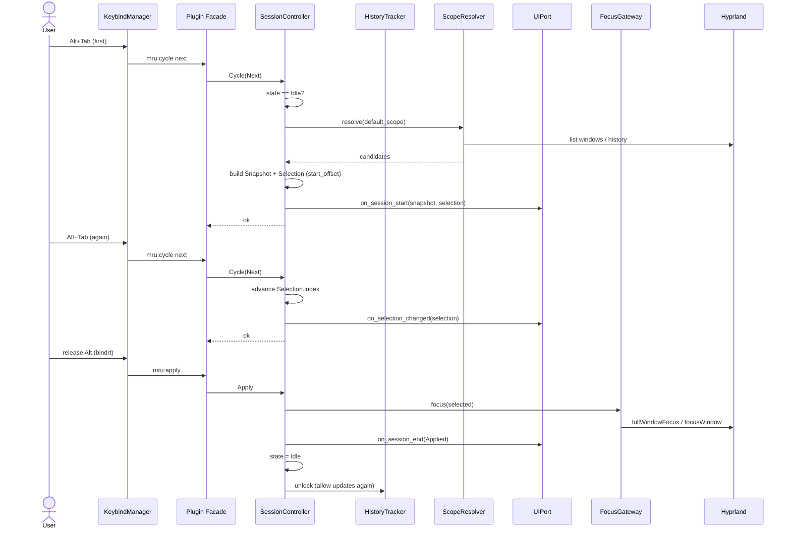
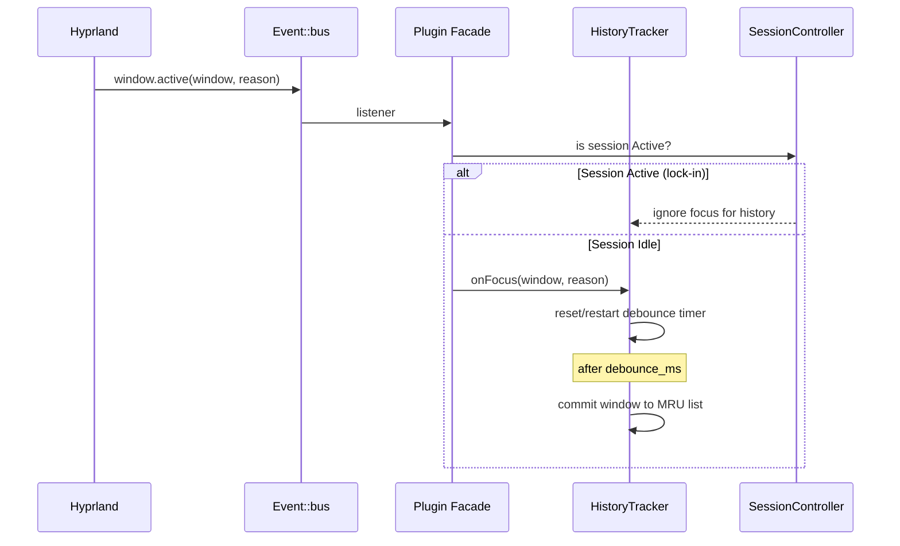
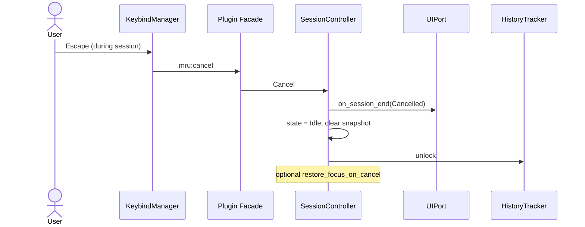
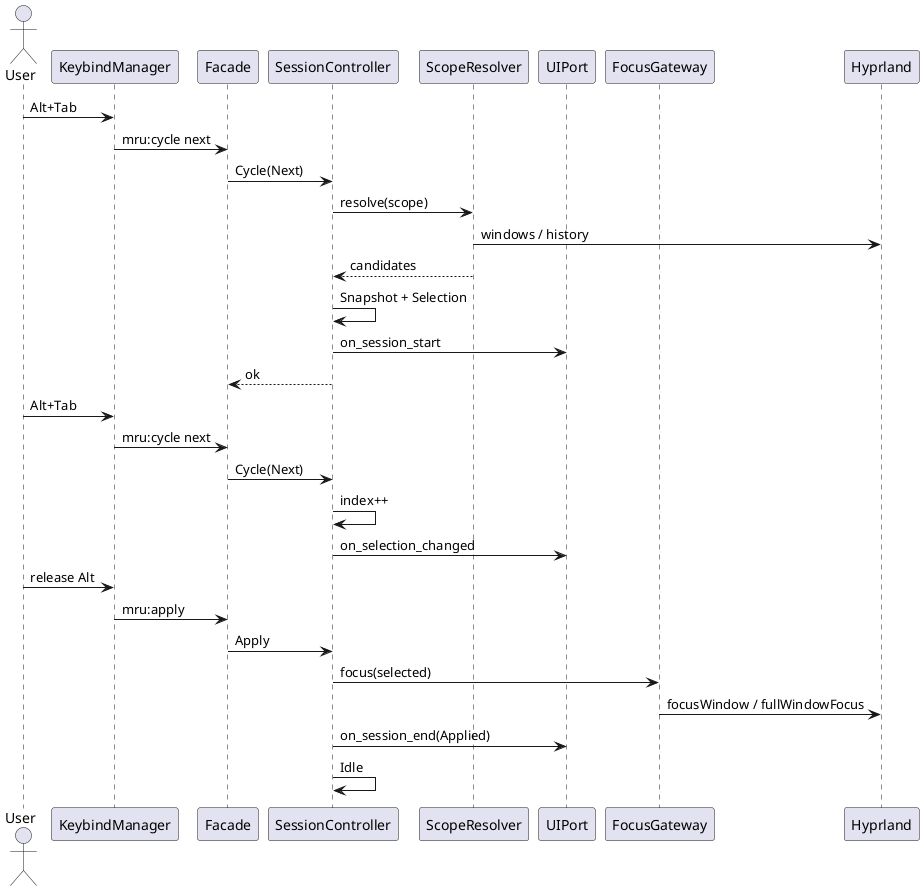

# MRU Window Switcher — Architecture

**Status:** Ready for implementation (descriptive; SPEC/ADR are normative)  
**Target:** Hyprland plugin (C++23)  
**Scope:** Niri-style Alt+Tab (MRU, snapshot, apply-on-release, focus lock-in)

---

## 1. Purpose

Provide a window switcher that:

- Orders windows by **Most Recently Used** (MRU).
- Freezes the candidate list (**Snapshot**) at session start so order does not change while the user tabs.
- Applies focus **only on modifier release** (or explicit `mru:apply`).
- Protects history from intermediate focus changes (FFM, `movefocus`, workspace hops) via **lock-in + debounce**.
- Supports multiple scopes: global, monitor, workspace, visible, app.
- Keeps UI pluggable (null / border highlight / external overlay).

This document describes the internal architecture, Hyprland integration points, and invariants.  
User-facing behaviour is in `USER.md`. Design decisions are in `DECISIONS.md`.

---

## 2. Hyprland Plugin API Constraints (authoritative)

Plugins are shared objects loaded into the Hyprland process. Relevant stable surface:

| Mechanism | API | Notes |
|-----------|-----|-------|
| Init / exit | `PLUGIN_INIT(HANDLE)`, `PLUGIN_EXIT()`, `PLUGIN_API_VERSION()` | Hash check **required** |
| Dispatchers | `HyprlandAPI::addDispatcherV2(handle, name, fn)` → `SDispatchResult(std::string)` | Prefer V2; old `addDispatcher` deprecated |
| Config | `addConfigValue` / `addConfigValueV2` **only inside** `PLUGIN_INIT` | Must live under `plugin:` namespace |
| Events (preferred) | `Event::bus()->m_events.window.active.listen(...)` etc. | Modern path; `registerCallbackDynamic` deprecated |
| Focus history | `Desktop::History::windowTracker()->fullHistory()` | Seed/fallback for MRU order (REQ-H-004a/b, ADR-015); primary order is the plugin-owned `HistoryTracker` |
| Focus application | `g_pCompositor->focusWindow` / `Desktop::focusState()->fullWindowFocus` | Single gateway in our code |
| Function hooks | `createFunctionHook` + `findFunctionsByName` | **x86_64 only**; last resort, feature-flagged |
| Private members | `#define private public` around includes | Allowed but increases breakage risk |

**Hard rules for this plugin:**

1. Always compare `__hyprland_api_get_hash()` vs `__hyprland_api_get_client_hash()` in `PLUGIN_INIT`.
2. Prefer `Event::bus()` over legacy hooks.
3. No threads that touch compositor state (Wayland loop is single-threaded).
4. Do not rely on ABI stability of internal types across commits; treat internals as “best effort” behind adapters.

Relevant events we subscribe to:

- `Event::bus()->m_events.window.active` — `(PHLWINDOW, Desktop::eFocusReason)`
- `Event::bus()->m_events.window.open` / `close` / `destroy`
- Optionally monitor / workspace moves for scope validity

Focus reasons of interest (`Desktop::eFocusReason`):  
`FOCUS_REASON_FFM`, `FOCUS_REASON_CLICK`, `FOCUS_REASON_KEYBIND`, `FOCUS_REASON_DISPATCH_FOCUSWINDOW`, and others.  
We use the reason to decide whether a focus change should update our HistoryTracker when not in a session.

---

## 3. Logical Architecture

```text
┌──────────────────────────────────────────────────────────────┐
│                    Plugin Facade (PLUGIN_INIT)               │
│  - hash check, config registration, dispatcher registration  │
│  - Event::bus subscriptions                                  │
└────────────────────────────┬─────────────────────────────────┘
                             │
         ┌───────────────────▼───────────────────┐
         │         SessionController             │
         │  (state machine: Idle ↔ Active)       │
         └───┬──────────┬────────────┬───────┬───┘
             │          │            │       │
     ┌───────▼──┐ ┌─────▼────┐ ┌─────▼────┐ ┌▼──────────┐
     │ History  │ │ Scope    │ │ Focus    │ │ UIPort    │
     │ Tracker  │ │ Resolver │ │ Gateway  │ │ (strategy)│
     └──────────┘ └──────────┘ └──────────┘ └───────────┘
             │          │
             └────┬─────┘
                  │
           ┌──────▼──────┐
           │   Domain    │  pure types + invariants
           │ Snapshot,   │  (no Hyprland types)
           │ Selection,  │
           │ Policy      │
           └─────────────┘

HistoryTracker and ScopeResolver are **independent** collaborators of SessionController.
Scope filters candidates when building a Snapshot; HistoryTracker only maintains MRU order.
There is no History→Scope dependency.
```

**Dependency rule:** Domain has zero knowledge of Hyprland.  
All compositor interaction goes through ports implemented in `adapters/`.

---

## 4. Domain Model

### 4.1 Core types

| Type | Responsibility |
|------|----------------|
| `WindowRef` | `{ address, generation }` stable identity (ADR-013); optional cached metadata for scope/UI |
| `Snapshot` | Immutable ordered list of `WindowRef` + scope + creation time |
| `Selection` | Index into a `Snapshot` + direction |
| `Session` | `Idle` \| `Active{ selection, policy snapshot }` |
| `SessionPolicy` | start offset, wrap, empty behaviour, apply-on-release |
| `Scope` | `Global` \| `Monitor` \| `Workspace` \| `Visible` \| `App` |

### 4.2 Invariants

1. While `Session == Active`, `Snapshot` is immutable.
2. `Selection.index` is always in-range for the current snapshot (or session ends).
3. `HistoryTracker` does **not** mutate its list while `Session == Active` (lock-in).
4. Focus is applied only via `FocusGateway` and only from `Apply` / explicit policy paths.
5. Domain operations are pure with respect to compositor state (no side effects).

---

## 5. Session State Machine

```text
          ┌─────────┐
          │  Idle   │
          └────┬────┘
               │ Cycle (first)
               ▼
          ┌─────────┐
     ┌───►│ Active  │◄── Cycle (subsequent)
     │    └────┬────┘
     │         │
     │    ┌────┼────┐
     │    │         │
     │  Apply    Cancel  (no session timeout in v0.x / 1.0)
     │    │         │
     └────┴────┬────┘
               ▼
          ┌─────────┐
          │  Idle   │
          └─────────┘
```

**Commands (from dispatchers):**

- `Cycle { direction: Next|Prev, scope_override? }`
- `Apply`
- `Cancel`

**External events:**

- Modifier released → treated as `Apply` when policy says so.
- Window closed that is in current snapshot → prune + clamp index (or cancel if empty).

---

## 6. HistoryTracker & Debounce

```text
window.active (Event::bus)
        │
        ▼
  Session active?
     yes → ignore (lock-in)
     no  → schedule / reset debounce timer (config: debounce_ms)
                │
                ▼ (timer fires)
         push / reorder MRU list
```

- Preferred ordering source when available: `Desktop::History::windowTracker()->fullHistory()`.
- Fallback: maintain our own list from `window.active` events.
- Debounce avoids polluting MRU with transient focuses (Niri `debounce-ms` analogue).
- At session start a still-pending debounce job is **flushed**: cancelled and committed
  immediately through the same validity guard (REQ-H-009), before the candidate list is
  built — so back-to-back `cycle → apply` taps rotate deterministically and nothing is
  ever pending once lock-in engages (REQ-H-011, ADR-021).

---

## 7. ScopeResolver

Builds the candidate set for a new Snapshot:

| Scope | Rule |
|-------|------|
| Global | All mapped, non-hidden, non-fading windows |
| Monitor | Windows on current monitor |
| Workspace | Windows on current workspace |
| Visible | Windows on currently visible workspaces |
| App | Same `class` as the focused window at snapshot time (SPEC REQ-SC-002; not initialClass) |

Invalid / closed windows are filtered at snapshot time and on prune.

---

## 8. Ports

### CompositorPort

- `list_windows() → Vec<WindowRef>`
- `focus(WindowRef)`
- `current_monitor()`, `current_workspace()`
- subscribe to focus / open / close (implemented via `Event::bus` in the adapter)

### ConfigPort

- `debounce_ms`, `default_scope`, `start_offset`, `ui_backend`, flags

### UIPort (Strategy)

- `on_session_start(snapshot, selection)`
- `on_selection_changed(selection)`
- `on_session_end(reason: Applied | Cancelled)`

Implementations (selected by config `ui`, ADR-004 / ADR-017):

```text
SessionController
       │
       ▼
   UIPort  ──►  NullUI
           ──►  BorderHighlightUI  (M4)
           ──►  ExternalOverlayUI  (M5)
```

- `NullUI` — no compositor side effects; always available (default `ui = null` in M4, ADR-011).
- `BorderHighlightUI` — M4. Solid border highlight of the selected window via public window-prop mechanisms ("public props first, fail-soft", ADR-017). Concrete pin symbols (Hyprland 0.56.2 / `efb5099…`) are **adapter-private**, recorded in `docs/COMPAT.md`; see the R0 memo `docs/agent-state/research/2026-09-17-m4-border-api.md` and the `UIPort` header `include/mru/domain/ui_port.hpp`.
- `ExternalOverlayUI` — M5 (ADR-018; fd-watch mechanism ADR-019): best-effort AF_UNIX stream socket; event-driven reads on the compositor main thread via removable Wayland event sources (`wl_event_loop_add_fd` / `wl_event_source_remove` on the pin, ADR-019); peer absent/dies → session logic unaffected, messages dropped (REQ-O-002). The concrete protocol lives in `src/plugin/overlay_protocol.*` (core), the POSIX server in `src/plugin/overlay_socket_server.*` (core), and the Hyprland fd watch in `src/plugin/hypr/hyprland_overlay_socket.*` (adapter).

### BorderHighlightUI (M4)

Responsibilities:

1. Map selection index → `WindowRef` from the active snapshot (controller still owns the snapshot).
2. Resolve the live window via the identity registry (same validity rules as focus: address + generation / weak-lock, ADR-013 / ADR-016).
3. Apply the style strategy (`SolidStyle` in M4) using adapter-private public APIs.
4. Track "currently highlighted" ref + prior border state for restore.
5. On selection change: restore previous, apply new.
6. On session end / teardown: restore all and drop tracking (REQ-UI-005).

Style strategy (foundation; `pulse` / `dim` reserved):

```text
BorderHighlightUI
    └── BorderStyleStrategy
            ├── SolidStyle      (M4 required)
            ├── PulseStyle      (reserved / follow-up)
            └── DimOthersStyle  (reserved / follow-up)
```

Unknown or not-yet-implemented style → `SolidStyle` (REQ-UI-007). Style behaviour is implemented inside the border UI adapter, never branching in `SessionController`.

**FocusGateway collaboration:** the border UI makes **no** focus calls (REQ-UI-006). Optional read-only use of the registry to resolve identities; it must not duplicate the FocusGateway write path.

Selection + border sequence:

```text
User Tab
  → mru:cycle
  → SessionController advances index
  → UIPort.on_selection_changed(index)
       → BorderHighlightUI restores prior window
       → BorderHighlightUI applies highlight to snapshot[index]
  → (no FocusGateway call)

User Alt release
  → mru:apply
  → FocusGateway.focus(selected)
  → UIPort.on_session_end(Applied)
       → BorderHighlightUI full clear
```

### FocusGateway

- Single function that calls into Hyprland focus APIs.
- Ensures we never scatter `focusWindow` calls across the codebase.

---

## 9. Plugin Facade Responsibilities

In `PLUGIN_INIT`:

1. Hash check; abort with notification on mismatch.
2. Register config values under `plugin:mru-switcher:*`.
3. `addDispatcherV2` for `mru:cycle`, `mru:apply`, `mru:cancel`, optionally `mru:status`.
4. Subscribe via `Event::bus()` to `window.active`, `window.close` (and others as needed).
5. Construct `SessionController` + adapters; store listeners so they outlive init.

In `PLUGIN_EXIT`:

- Hyprland unregisters dispatchers / config automatically.
- Release any external UI resources if owned.

Dispatchers only parse args and forward to `SessionController`. No business logic in the facade.

---

## 10. Public Dispatcher Contract

| Name | Arguments | Behaviour |
|------|-----------|-----------|
| `mru:cycle` | `[next\|prev] [scope?]` | Start session or move selection |
| `mru:apply` | — | Focus selected window, end session |
| `mru:cancel` | — | End session without applying (optional restore) |
| `mru:status` | — | Frozen payload (SPEC §3.4): `active= index= size= scope= session= last_end=` in order (idle `scope=` = effective `default_scope`) |

Recommended binds (see `USER.md`):

```conf
bind   = ALT, TAB,       mru:cycle, next
bind   = ALT SHIFT, TAB, mru:cycle, prev
bindrt = ALT, ALT_L,     mru:apply
bind   = ALT, Escape,    mru:cancel
```

---

## 11. Configuration Surface

```conf
plugin {
    mru-switcher {
        debounce_ms             = 400
        default_scope           = global   # global|monitor|workspace|visible|app
        start_offset            = second   # first|second
        wrap                    = true
        ui                      = null     # null|border|external (border from M4)
        border_style            = solid    # solid in M4; pulse/dim reserved -> solid + warn-once
        border_color            = 0xffffd9a0   # highlight colour; format per pin (see USER/API)
        border_size             = -1       # -1 = do not touch size (colour only)
        restore_focus_on_cancel = false
        external_socket         =        # AF_UNIX path for ui=external (REQ-O-001; empty = degrade to null)
    }
}
```

All keys registered only in `PLUGIN_INIT`.

Effective UI backend is frozen for the Active session: `SessionUIBackendProxy` rebuilds the
backend from live config at `on_session_start` and keeps it for the session lifetime
(REQ-UI-009); `SessionPolicy` itself carries only scope/wrap/start_offset/restore —
history lock-in is not a policy option but a mandatory invariant (REQ-H-001/010, ADR-021).
A config reload updates only the values used for the **next** Idle → Active transition
(REQ-UI-009, REQ-CFG-002). Backend factory (plugin state build / policy refresh):

```text
read config ui
  null     → NullUI
  border   → BorderHighlightUI(style, color, size)
  external → ExternalOverlayUI(socket, resolver)   (M5, ADR-018; fd watch ADR-019)
             empty/broken socket → NullUI + warn-once (REQ-O-001)
             socket is bound early (on the config.reloaded that follows plugin load)
             so a peer may connect before the first session; clearing the path or
             switching `ui` away from `external` tears the listener down.
```

---

## 12. Testing Strategy

| Layer | What | Dependencies |
|-------|------|--------------|
| Unit | Session state machine, Selection wrap, Policy | None (pure domain) |
| Unit | HistoryTracker debounce + lock-in | Fake clock |
| Integration | Dispatchers + snapshot + apply | Nested Hyprland |
| Manual | bindrt, multi-monitor, special WS | Checklist in USER.md |

The border layer uses the same split: the controller calling UIPort in the right order is covered by domain tests with a mock UIPort; restore/clear/invalid-ref behaviour by border-adapter tests + nest; config parse + fallback style by plugin config tests (REQ-UI-001..011).

---

## 13. Extension Points

- New UI backend → implement `UIPort`.
- New scope → extend `Scope` + `ScopeResolver`.
- Optional function-hook path for “hard” focus interception → behind feature flag, x86_64 only.

---

## 14. Non-Goals (v1)

- Live window previews inside the plugin.
- Replacing Hyprland’s built-in focus history.
- Guaranteeing behaviour on non-x86_64 if hooks are enabled.
- Custom window rules registration (Hyprland still limits this for plugins).
- A UI thread separate from the compositor loop (UI stays main-thread / event-loop safe, same as SchedulerPort).

---

## 15. Sequence Diagrams

### 15.1 Session lifecycle



### 15.2 Focus path + history lock-in



### 15.3 Cancel path



### 15.4 PlantUML (session lifecycle, alternative)


