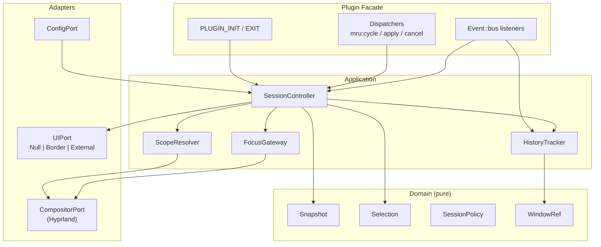
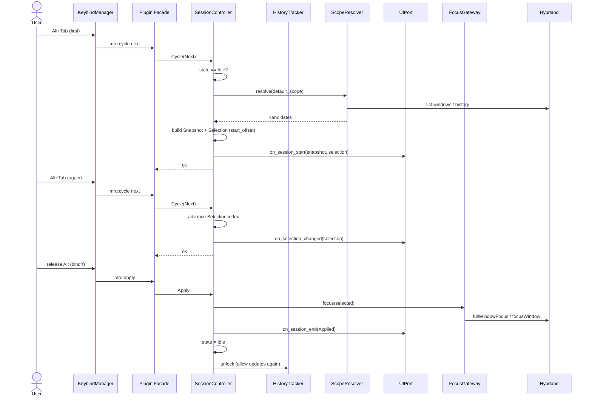
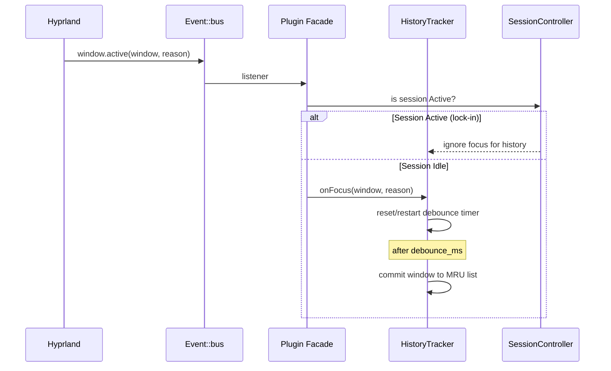
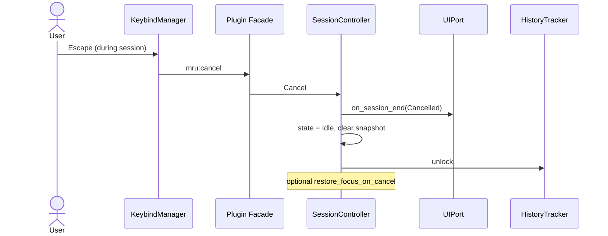
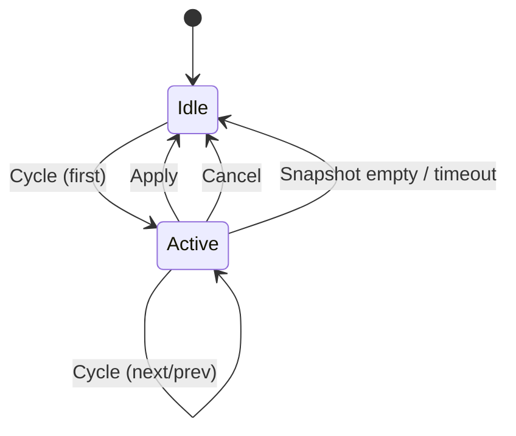
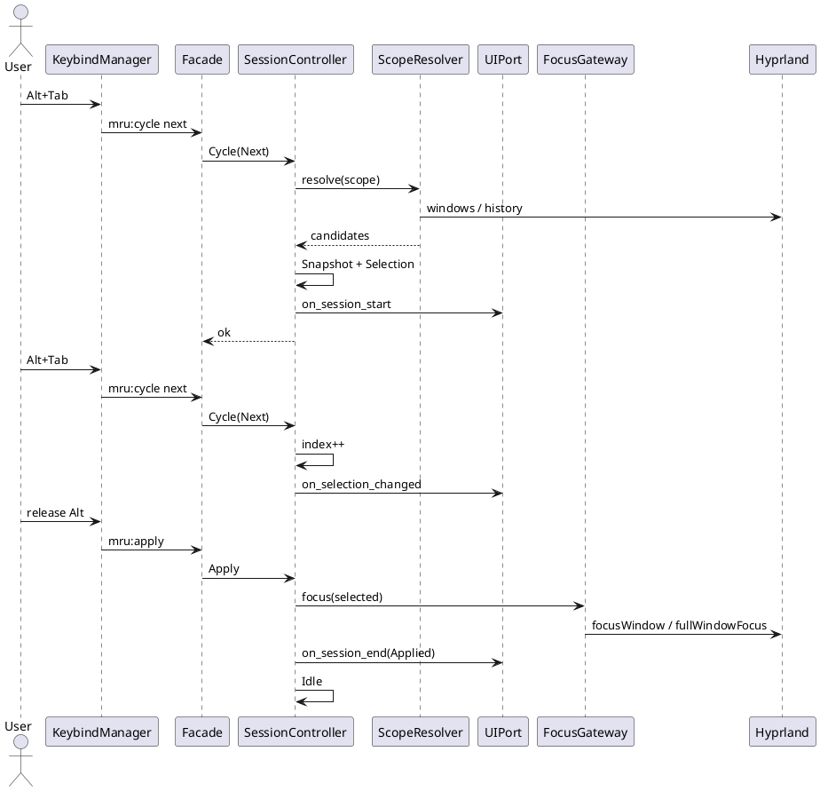
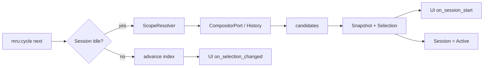

# MRU Window Switcher — Diagrams

Standalone sequence and structure diagrams.  
Also embedded in `ARCHITECTURE.md`. Render with any Mermaid-compatible viewer (GitHub, GitLab, VS Code, mermaid.live).

---

## 1. Component overview

---

## 2. Session lifecycle

---

## 3. Focus path and history lock-in

---

## 4. Cancel path

---

## 5. State machine

---

## 6. PlantUML — session lifecycle (alternative)

---

## 7. Data flow on first cycle

