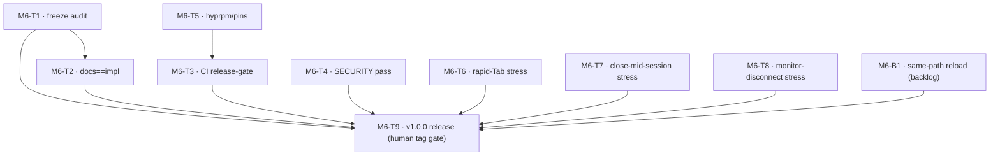

# M6 — Hardening → v1.0 (implementation plan)

> **Status:** DRAFT plan. No code / SPEC / ADR changes in this document.
> **Date:** 2026-09-19 · **Milestone:** ROADMAP §M6 · **Base:** `main` (tagged `v0.5.0`)
> **Sources:** `docs/ROADMAP.md` §M6, `docs/agent-state/PROGRESS.md` (M6), `docs/COMPAT.md` "Known limitations (0.5.0)", `docs/agent-state/reports/2026-09-19-m5-s3-nest-smoke.md`, `CHANGELOG.md` [0.5.0], `hyprpm.toml`, `docs/SECURITY.md`, `docs/VERSION-MAP.md`.
> **Execution path:** each ticket = one branch + one PR to `main` (AGENTS §5–6); orchestrator runs `plugin-spec-compliance` + `code-review` before merge; tag `v1.0.0` is human-gated (AGENTS §6.4/§16).

---

## 1. Goal + M6 exit criteria + what "contract freeze" means

**Goal (ROADMAP):** production release — the hardening pass that turns the feature-complete 0.5.0 plugin (M1–M5) into a stable 1.0.

**M6 exit criteria (ROADMAP, restated):**
1. Tagged `v1.0.0`.
2. No known session-invariant violations (the 6 invariants in `.agents/skills/mru-switcher/SKILL.md` §Core invariants).
3. Docs match implementation.

**M6 deliverables (ROADMAP):** (a) CI unit-test depth + nested smoke where feasible; (b) hyprpm manifest / commit pins; (c) changelog + semver policy; (d) stress cases (rapid Tab, window close mid-session, monitor disconnect); (e) SECURITY notes; (f) freeze dispatcher/config contracts for 1.x.

**"Contract freeze" for 1.x** — the following become **stable** (AGENTS §15 / VERSION-MAP: breaking changes then require a major bump):

| Surface | Frozen contract |
|---------|-----------------|
| Dispatchers | Names + grammar stable: `mru:cycle [next\|prev] [global\|monitor\|workspace\|visible\|app]`, `mru:apply`, `mru:cancel`, `mru:status`. No new-arg renames. |
| `mru:status` payload | Lifts the SPEC §3.4 "informative and non-parsable until 1.0" qualifier → format becomes **normative/stale-analyzed**. The 0.56.2 `hyprctl` IPC-observability caveat (payload only surfaces on failure) stays a documented **host** limitation, not a contract gap. |
| Config keys | The full `plugin:mru-switcher:` surface stays stable: `ui`, `external_socket`, `start_offset`, `wrap`, `debounce_ms`, `default_scope`, `restore_focus_on_cancel`, `border_style`, `border_color`, `border_size`. Defaults + `config.reloaded` refresh-next-session semantics pinned (REQ-CFG-002/003, REQ-S-009). |
| Snapshot/apply semantics | Snapshot frozen at session start (pruning only) → virtual selection (`mru:cycle` never focuses, REQ-F-003) → apply is exactly one focus via FocusGateway (apply-on-release); apply-after-invalidation = prune → clamp → apply or `no windows` (SPEC §2.8); restore applies to explicit `mru:cancel` only (REQ-R-003); lock-in with debounce (ADR-001..003). |

Note: lifting the §3.4 "until 1.0" qualifier is the freeze itself (behavior unchanged). If the freeze audit (M6-T1) finds a **semantic gap** that requires a behavior change, that becomes a **separate ticket requiring an ADR** — never a silent tweak inside the freeze PR.

---

## 2. Tracer-bullet tickets

### M6-T1 — Contract-freeze audit & freeze declaration

**Scope.** Read SPEC §2/§3/§4 line-by-line against the implemented surface (dispatchers incl. `mru:status` payload, all 10 config keys, snapshot/apply/restore semantics) and produce a freeze statement that declares them stable for 1.x. Flip the §3.4 "until 1.0" qualifier to normative; restate the semver/versioning rule (AGENTS §15, VERSION-MAP) in the freeze section; record the `mru:status` IPC caveat as a host limitation. A gap found here must be split out, not fixed in this PR (per §1; behavior changes → ADR). No semantics change is permitted in this ticket.

**Blocked by:** none (can start immediately).
**SPEC ids:** REQ-DISP-001/002/003, REQ-CFG-002/003, REQ-S-001..011 (incl. REQ-S-009), REQ-SNAP-002, REQ-R-003, REQ-F-003, REQ-SC-002, REQ-ID-006.
**Files/areas:** `docs/SPEC.md` (§2/§3/§4 + freeze paragraph), `docs/API.md`, `docs/USER.md`, `docs/VERSION-MAP.md`, `docs/COMPAT.md` (status caveat row), `docs/agent-state/PROGRESS.md`.
**Done when:**
- [ ] Freeze statement committed; §3.4 qualifier flipped to normative; no behavior code touched.
- [ ] Every user-facing gap found during audit is either declared frozen as-is or written up as a follow-up ticket (with ADR requirement flagged if semantic).
- [ ] CI green; `plugin-spec-compliance` review passes.

### M6-T2 — Docs == implementation audit & close-out

**Scope.** Diff every contract doc against the real behavior, closing the "docs match implementation" exit criterion. Specifically: verify `mru:status` payload format, dispatcher errors, config reload behavior, UI fallback ladder (`external`/`border`/`null` + warn-once), and scope rules are stated exactly as implemented; reconcile REQ-TRACE.md against the current test suite (every T-* id maps to a live test); make sure the two 0.5.0 limitations carried in COMPAT (keyword-channel limitation, non-cancel-end unit-only live) are reflected honestly in USER.md. Any doc/implementation drift found → fix the doc here (docs ticket); drift that is really a behavior bug → split into a `fix/` ticket, do not paper over.

**Blocked by:** M6-T1 (freeze statement defines the target contract).
**SPEC ids:** cross-cutting; the REQ/T-id set enumerated in M6-T1 + test ids T-S-*, T-H-*, T-F-*, T-SEL-*, T-ID-*, T-SC-*, T-UI-*, T-O-*, T-CFG-*.
**Files/areas:** `docs/USER.md`, `docs/API.md`, `docs/REQ-TRACE.md`, `docs/COMPAT.md`, `docs/SPEC.md` (only cross-references/ids, no semantics), `README.md` (install/usage parity).
**Done when:**
- [ ] Every user-facing doc claim traced to a test or a recorded live-caveat; no "claimed but untested" rows left except documented unit-only gaps.
- [ ] REQ-TRACE.md covers all tests present at M6 entry plus the new M6-T6/T7/T8 test ids (added there).
- [ ] No behavior code touched; CI green.

### M6-T3 — CI depth + release-gate guard

**Scope.** Close the "CI unit-test depth + nested smoke where feasible" deliverable. Document (SUPPORT-AND-RELEASE.md release checklist + CI workflow comment) that nested Hyprland smoke stays a **manual release gate** — a CI runner cannot stage an honest nested Wayland/compositor deterministically; the current `.github/workflows/ci.yml` 6-job matrix (unit, sanitize, gcc, plugin-build, domain-deps, plugin-guards) stays as-is but gains the new M6 stress tests in its `ctest` runs automatically. Add a `release-readiness` CI job that fails a would-release state when: version is ≥1.0.0 and `hyprpm.toml` lacks a populated `commit_pins`; `docs/COMPAT.md` has no matrix row for the current version; `CHANGELOG.md` still has a non-empty `[Unreleased]`. This makes "pins + changelog + docs==impl" enforceable instead of aspirational.

**Blocked by:** M6-T5 (the release-readiness job asserts on `commit_pins`, which T5 establishes).
**SPEC ids:** REQ-H-004 (pin/version contract), n/a otherwise (process/CI).
**Files/areas:** `.github/workflows/ci.yml` (new `release-readiness` job), `docs/SUPPORT-AND-RELEASE.md`, `docs/COMPAT.md` verification-checklist note, `hyprpm.toml` (read-only assert target).
**Done when:**
- [ ] `release-readiness` job present; it fails when the three invariants (commit_pins, COMPAT row, empty `[Unreleased]`) are violated at a ≥1.0.0 version state.
- [ ] SUPPORT-AND-RELEASE.md and the release checklist state "manual nested smoke is a v1.0.0 gate".
- [ ] Existing 6 jobs still green on the branch (job added, none removed).

### M6-T4 — SECURITY notes release pass

**Scope.** Release-grade pass on `docs/SECURITY.md` (does not change behavior): keep the in-process trust model and "do not load untrusted `.so`" framing; expand the surface table with the M5 peer as today — AF_UNIX socket, peer input validated/bounds-checked, no shell-out on peer data (see THREAT-MODEL.md); add the explicit release advisory that a plugin has compositor privileges and that 1.0 distribution is source-build + hash-checked binaries (never precompiled blobs from untrusted remotes); keep/confirm the non-goals (no sandboxing) and the reporting section. Cross-link THREAT-MODEL.md / OBSERVABILITY.md rather than duplicating.

**Blocked by:** none.
**SPEC ids:** n/a (process/docs); references REQ-O-001..008 (peer validation posture) as context.
**Files/areas:** `docs/SECURITY.md`, cross-links to `docs/THREAT-MODEL.md`, `docs/SUPPORT-AND-RELEASE.md`.
**Done when:**
- [ ] SECURITY.md covers the five surface rows incl. the socket; release advisory + trust model stated; no behavior change.
- [ ] Confirmed consistent with THREAT-MODEL.md; reviewer sign-off.

### M6-T5 — hyprpm manifest + commit_pins + clean-checkout build

**Scope.** Populate `hyprpm.toml` for distribution: set `commit_pins = ["efb50993780079460b0cbed1363e2166a2de1d9f = <plugin_commit_at_tag>"]` (Hyprland pin is fixed at closure of this ticket; the plugin-side hash is finalized at tag time in M6-T9 — document that in a comment); fill repository metadata. Verify the build stanza builds the real `.so` from a **clean checkout** (fresh directory, Release, `MRU_BUILD_PLUGIN=ON`, output `build/mru-switcher.so`). Update the COMPAT matrix with a v1.0.0 row (hyprpm-tested or documented "hyprpm install smoke pending release tag"), VERSION-MAP row, and README install section. State explicitly in COMPAT that pinning is a release contract (existing "Risk note").

**Blocked by:** none.
**SPEC ids:** REQ-H-004, n/a otherwise.
**Files/areas:** `hyprpm.toml`, `docs/COMPAT.md`, `docs/VERSION-MAP.md`, `README.md` (install), `docs/HYPRLAND-PLUGIN-SYSTEM.md` (pin reference).
**Done when:**
- [ ] `hyprpm.toml` parses (`hyprpm validate` if available; else manual) and `commit_pins` populated with the Hyprland pin + documented tag-time mechanism.
- [ ] Clean-checkout `cmake -S . -B build -DMRU_BUILD_PLUGIN=ON && cmake --build build -j` produces `build/mru-switcher.so`.
- [ ] COMPAT v1.0.0 matrix row + VERSION-MAP row committed; README install instructions match.
- [ ] No plugin code changes.

### M6-T6 — Stress: rapid Tab hammer

**Scope.** Formalize rapid-tab robustness end-to-end. Domain: add a stress test driving `SessionController` through ≥1000 consecutive `cycle()` calls on `FakeClock`, asserting every step's invariants (snapshot identical, selection virtual — no focus side effect, index wraps per policy, lock-in held, no exceptions); plus an interleave burst (cycle×N → cancel → cycle×N → apply) asserting apply focuses exactly once. Adapter: `HyprlandWindowSource`/candidate-order path already covered; add nothing there unless the hammer exposes a defect (then split a `fix/` ticket). Nest: recipe for 200 rapid `hyprctl dispatch mru:cycle next` calls + final `mru:apply`, asserting `activewindow` unchanged during, single focus on apply, MRU order stable — record as an M6 smoke report row (replaces the M2 ad-hoc repetition).

**Blocked by:** none.
**SPEC ids:** REQ-F-003, REQ-S-001/002, REQ-PERF-001; continuation of T-H-01 / T-SEL-0x. New test ids named in REQ-TRACE (T-H-06 rapid-cycle; note in SPEC test table only if the project requires it — prefer REQ-TRACE row).
**Files/areas:** `tests/domain/test_session_controller.cpp`, `tests/domain/test_history_tracker.cpp`, `docs/agent-state/reports/2026-09-XX-m6-rapid-tab-smoke.md`, `docs/REQ-TRACE.md`, `docs/COMPAT.md`.
**Done when:**
- [ ] 1000-cycle + interleave domain tests committed and green in all of clang/ASan+UBSan/gcc ctest runs.
- [ ] Nested rapid-Tab smoke row recorded (PASS, with counts) or the defect it surfaced is a tracked `fix/` ticket.
- [ ] REQ-TRACE/COMPAT updated; CI green (test count expected to rise).

### M6-T7 — Stress: window close mid-session matrix

**Scope.** Systematize close-mid-session behavior beyond today's T-F-03/T-F-04/N3. Domain: a unit matrix closing windows at **every snapshot index** before `apply` (selected, before-selection, after-selection, origin, all-but-selected, all) asserting prune → clamp → apply or `no windows` per SPEC §2.8, and that the selection clamp never underflows/raises. Live: two new nest rows — close the **selected** window mid-session then `mru:apply` (prune/clamp or empty-error), and close **multiple** windows mid-session then apply — complementing the already-recorded N3 (origin closed, M4).

**Blocked by:** none.
**SPEC ids:** REQ-S-006, REQ-SNAP-002, REQ-DISP-002, T-F-03/T-F-04, T-S-06; new matrix rows tracked under T-F-0x in REQ-TRACE.
**Files/areas:** `tests/domain/test_session_controller.cpp` (matrix), `docs/agent-state/reports/2026-09-XX-m6-close-mid-session-smoke.md`, `docs/REQ-TRACE.md`, `docs/COMPAT.md`.
**Done when:**
- [ ] Full close-index matrix green in domain ctest (all three toolchains).
- [ ] Select-close and multi-close nest rows recorded PASS (or surfaced defect tracked as `fix/`).
- [ ] REQ-TRACE/COMPAT updated.

### M6-T8 — Stress: monitor disconnect

**Scope.** Verify behavior when a monitor disappears mid-session (windows on it become unmapped/invalid — expectation: weak-lock validity + `is_candidate` mapped rule (ADR-013/016, REQ-SNAP-002) already prune them on apply). Domain: simulate a monitor drop — `WindowMeta` flipped to `mapped=false` / `monitor_id` gone for a subset of candidates mid-session — asserting `scope_matches` (monitor/workspace scope) excludes them and apply prunes/clamps correctly. Live: attempt an honest 2-monitor nest (two `monitor = ,1920x1080@60,auto,<n>` lines on the Wayland backend) and remove one monitor mid-session; if the pin/aquamarine cannot stage a removal honestly, **document it as unit-only** (same posture as the non-cancel-end gap) rather than improvising. Any live deviation from SPEC → separate ticket + ADR, never a silent fix.

**Blocked by:** none.
**SPEC ids:** REQ-SC-002, REQ-SNAP-002, REQ-ID-006, T-SC-01..04, T-S-06.
**Files/areas:** `tests/domain/test_scope_predicate.cpp`, `tests/domain/test_session_controller.cpp`, `docs/agent-state/research/2026-09-XX-m6-monitor-disconnect.md` (feasibility memo), `docs/COMPAT.md`.
**Done when:**
- [ ] Domain monitor-drop tests green (prune/clamp correct, no exception).
- [ ] 2-monitor nest attempt documented: honest live row **or** explicit unit-only limitation recorded in COMPAT.
- [ ] No behavior change smuggled into this ticket (any required change → separate ADR ticket).

### M6-T9 — v1.0.0 release close-out

**Scope.** Milestone completion. Move `[Unreleased]` → `[1.0.0]` in CHANGELOG; fill VERSION-MAP 1.0.0 row (pin, notes, "stable contracts"); finalize `hyprpm.toml` `commit_pins` plugin-side hash from the tag commit; run the full §16.2 release checklist (PROGRESS M6 complete, nested smoke checklist, COMPAT verification checklist, docs==impl). Confirm M6-B1 outcome is stated in release notes (fixed or documented limitation). Tag `v1.0.0` on the merge commit — **human gate** (AGENTS §6.4/§16.2: release tags require human approval). Runs the three M6 exit criteria as a final checklist.

**Blocked by:** M6-T1, M6-T2, M6-T3, M6-T4, M6-T5, M6-T6, M6-T7, M6-T8, and the M6-B1 outcome.
**SPEC ids:** n/a (process; closes the M6 exit criteria).
**Files/areas:** `CHANGELOG.md`, `docs/VERSION-MAP.md`, `hyprpm.toml`, `docs/agent-state/PROGRESS.md`, `docs/agent-state/SESSION.md`, `docs/COMPAT.md`, release notes.
**Done when:**
- [ ] All three M6 exit criteria (tag, no known invariant violations, docs==impl) verified against the merged `main`.
- [ ] `v1.0.0` tag pushed on the release merge commit; GitHub release notes = CHANGELOG section.
- [ ] PROGRESS M6 fully checked; SESSION next-action idle; VERSION-MAP row final.

---

## 3. ROADMAP M6 deliverable coverage

| ROADMAP M6 deliverable | Ticket(s) |
|------------------------|-----------|
| CI: unit tests + nested smoke (where feasible) | M6-T3 (guard/gate) + M6-T6/T7/T8 (new tests ride the existing ctest matrix, incl. plugin-build) |
| hyprpm manifest / commit pins | M6-T5 (populate) + M6-T9 (tag-time hash) + M6-T3 (CI asserts them) |
| Changelog, versioning policy (semver) | M6-T1 (freeze/version statement) + M6-T9 (changelog move + policy applied) |
| Stress cases: rapid Tab | M6-T6 |
| Stress cases: window close mid-session | M6-T7 |
| Stress cases: monitor disconnect | M6-T8 |
| SECURITY notes (in-process trust model) | M6-T4 |
| Freeze dispatcher/config contracts for 1.x | M6-T1 (+ M6-T2 verifies docs follow) |
| Exit: tagged v1.0.0 | M6-T9 |
| Exit: no known session-invariant violations | M6-T6/T7/T8 (+ M6-T2 audit) |
| Exit: docs match implementation | M6-T1/T2 (+ CI assert in M6-T3) |

Backlog (soft, feeds M6-T9 accuracy): known 0.5.0 limitation same-path changed-`.so` reload → M6-B1.

---

## 4. Backlog item (not a blocker) — M6-B1: same-path changed-`.so` reload crash

**Frame: "confirm on host, then fix or document".** The 0.5.0 limitation in COMPAT (and M5 smoke observation, `hyprlandCrashReport75967`): loading a *rebuilt* `mru-switcher.so` over a path the process already `load`/`unload`ed can crash during init; clean on a fresh process; almost certainly Hyprland `dlopen`-handle reuse across a changed file (host-side behavior). This is **not** on the v1.0 critical path and does not block any M6-T ticket; it only gates the *accuracy of the release note* (M6-T9 must state the final disposition).

- **Step 1 — confirm on host (bounded, ~1 session):** in a fresh nest, structured repro script: load v1 α → unload → write a *different* binary to the same path → load again; record crash/ok per run (×3 attempts). No ASan available for the compositor itself; rely on `hyprlandCrashReport*` capture if it recurs.
- **Step 2 — decide:** if never reproduced on `main` at the current pin, **document** (refresh COMPAT/USER operator guidance: "changed binary → fresh nest or new path", add a release-note line) and **stop** — no speculative mitigation. If reproduced with a stable repro, attempt a plugin-side mitigation **only if** one is cheap and low-risk (e.g., reject a reload whose build identity differs from the previously loaded one); any such behavior change needs its own SPEC/ADR-aware fix ticket, still not blocking M6.
- **Done when:** a one-line resolution (fixed / documented / deferred) recorded in COMPAT and carried into M6-T9's release notes; reopened as its own `fix/` or `docs/` issue either way.

---

## 5. Sequencing, dependency graph, first ticket

**Frontier at start (no blockers):** M6-T1, M6-T4, M6-T5, M6-T6, M6-T7, M6-T8. The graph is intentionally flat; only three real edges exist (T1→T2, T5→T3, critical-path → T9), so most hardening can proceed in parallel or in any order.

**Recommended first ticket: M6-T1 (contract-freeze audit).** It is the definitional baseline: it pins down what "stable" means before the stress tickets (T6/T7/T8) encode expectations against it, unblocks the docs==impl audit (T2), and its outcome — not assumptions — feeds the release statement in T9. Cheap, docs-only, no blockers, immediately mergeable. If you want pure automation first instead, M6-T5 (hyprpm/pins) is the runner-up: also unblocked, and T3's guard only lands once pins exist.

---

## 6. DRAFT GitHub issues (for orchestrator to create after human approval)

These are **DRAFT titles + body outlines only** — to be created by the orchestrator, one per ticket, in dependency order, with `milestone:M6`/`area:*` labels per AGENTS §6.1.

- **[DRAFT] M6-T1: Freeze dispatcher/config/snapshot-apply contracts for 1.x**
  Body: audit SPEC §2/§3/§4 vs implemented surface; declare dispatcher grammar, all `plugin:mru-switcher:` keys, and snapshot/apply/restore semantics stable; flip SPEC §3.4 `mru:status` "until 1.0" qualifier to normative; record the 0.56.2 IPC-observability caveat as a host limitation. No behavior change permitted; semantic gaps → follow-up ticket + ADR.

- **[DRAFT] M6-T2: Docs == implementation audit and close-out**
  Body: verify USER.md/API.md/README claims against real behavior; reconcile REQ-TRACE.md with the live suite; ensure the two 0.5.0 limitations (keyword-channel, unit-only non-cancel-end) are honestly stated. Split any behavior bug out as a `fix/` ticket instead of doc-editing over it.

- **[DRAFT] M6-T3: CI depth — release-readiness guard + manual-nest-gate doc**
  Body: add a CI job that fails a ≥1.0.0 state missing `commit_pins`, a COMPAT row, or with un-moved `[Unreleased]`; document that nested smoke is a manual release gate (runner cannot stage an honest nest deterministically). Existing 6 jobs unchanged.

- **[DRAFT] M6-T4: Security notes release pass (trust model)**
  Body: expand SECURITY.md surface table incl. the M5 socket peer; release advisory (in-process compositor privileges, source-build + hash-checked binaries); cross-link THREAT-MODEL.md; confirm non-goals. Docs only.

- **[DRAFT] M6-T5: hyprpm manifest + commit_pins + clean-checkout build**
  Body: populate `commit_pins` (Hyprland `efb5099` now, plugin hash at tag); verify the build stanza produces `build/mru-switcher.so` from a clean checkout; add COMPAT v1.0.0 row + VERSION-MAP row + README install update.

- **[DRAFT] M6-T6: Stress — rapid Tab hammer (domain + nest)**
  Body: ≥1000-cycle + interleave unit stress on FakeClock asserting invariants; 200-rapid-cycle nest recipe with single-focus apply; record smoke report; new T-H-id row in REQ-TRACE.

- **[DRAFT] M6-T7: Stress — window close mid-session matrix**
  Body: unit matrix closing windows at every snapshot index before apply (prune → clamp → apply/`no windows`); live rows for selected-window close and multi-window close; complement existing N3 (origin close).

- **[DRAFT] M6-T8: Stress — monitor disconnect (2-monitor nest feasibility)**
  Body: domain monitor-drop simulation (WindowMeta flipped unmapped) asserting scope exclusion + prune/clamp; attempt honest 2-monitor nest removal; if unstagable, document unit-only like the non-cancel-end gap. Live deviation → separate ADR ticket.

- **[DRAFT] M6-T9: v1.0.0 release close-out (tag + changelog + pins)**
  Body: move `[Unreleased]`→`[1.0.0]`; final VERSION-MAP row; finalize `commit_pins` plugin-side hash; run §16.2 checklist (incl. M6-B1 disposition); tag `v1.0.0` on the merge commit — **human-gated**.

- **[DRAFT] M6-B1: Backlog — same-path changed-`.so` reload crash (confirm, then fix or document)**
  Body: reproduce the CR75967-style reload crash in a fresh nest (bounded attempts at the current pin); outcome = fix (if cheap + low-risk, via a SPEC-aware ticket) or documentation (refresh COMPAT/USER operator guidance) + release-note line. Explicitly **not** blocking M6-T1..T8.